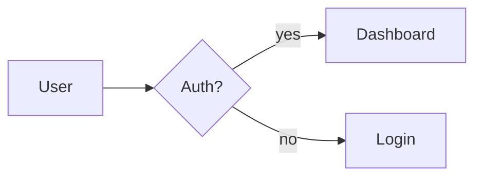

# diagramming

Diagrams belong in replies when structure or flow is the point. Generate them as text — Mermaid or PlantUML syntax — so the user's client (GitHub, Obsidian, most modern chat apps) renders them automatically, or so the user can paste into a renderer themselves. No image generation tool required.

## Mermaid — the default

Mermaid is the broadly supported option. Embed as a fenced code block with language tag `mermaid`:

````

````

### Common diagram types

**Flowchart** — processes, decisions.

```
flowchart TD
    A[Start] --> B{Condition}
    B -- yes --> C[Step]
    B -- no --> D[Alt step]
    C --> E[End]
    D --> E
```

Directions: `TD` / `TB` top-down, `LR` left-right, `RL`, `BT`.
Shapes: `[text]` rectangle, `(text)` rounded, `{text}` diamond, `((text))` circle, `[/text/]` parallelogram.

**Sequence** — ordered interaction between actors.

```
sequenceDiagram
    participant U as User
    participant S as Server
    U->>S: request
    S-->>U: response
```

`->>` solid arrow, `-->>` dashed. `activate`/`deactivate` to show active periods. `Note over U,S: text` for annotations.

**Class** — OO structure.

```
classDiagram
    class Account {
        +String email
        -String passwordHash
        +login() bool
    }
    Account <|-- AdminAccount
```

`+` public, `-` private, `#` protected. `<|--` inheritance, `*--` composition, `o--` aggregation.

**State** — state machine.

```
stateDiagram-v2
    [*] --> Idle
    Idle --> Running: start
    Running --> Done: finish
    Done --> [*]
```

**Gantt** — scheduling, deadlines.

```
gantt
    dateFormat  YYYY-MM-DD
    section Core
    Design       :a1, 2026-05-01, 7d
    Build        :after a1, 14d
    section QA
    Test         :2026-05-22, 7d
```

Other supported types include ER diagrams, pie charts, user journeys, mindmaps, and timelines — use them when they match the data.

## When to reach for PlantUML instead

- Enterprise environments that render PlantUML but not Mermaid (some Confluence / JetBrains setups).
- UML constructs Mermaid doesn't cover well (activity diagrams, deployment diagrams).

PlantUML source:

```
@startuml
Alice -> Bob: request
Bob --> Alice: response
@enduml
```

Embed as a code block with language `plantuml`. Client support is narrower than Mermaid — ask before picking it.

## Rendering locally (optional)

If the user wants an image file rather than text:

- Mermaid: `mmdc -i input.mmd -o output.svg` (requires the `mermaid-cli` / `@mermaid-js/mermaid-cli` npm package).
- PlantUML: `plantuml input.puml` (requires Java + `plantuml.jar` on PATH, or a `plantuml` wrapper).

Check availability before invoking:

```
command -v mmdc
command -v plantuml
```

If neither is installed and the user needs an image, say so rather than faking it.

## Rules

- Keep diagrams focused. Ten-node flowcharts are useful; forty-node ones are unreadable.
- Label every edge and decision. An unlabelled diamond is not a decision.
- Match direction to content: user-facing flows left-to-right, system decomposition top-down.
- Escape special characters in labels (`>`, `|`, quotes). Mermaid requires careful quoting — when a label is complex, wrap it in `"..."`.

## Anti-patterns

- Diagrams that duplicate the prose without adding structure.
- Diagrams with no direction or hierarchy — just a list pretending to be a graph.
- Inventing Mermaid features. If you are not sure the syntax is real, say so and fall back to plain bullets.
- Using a gantt chart to represent a two-item todo list.
